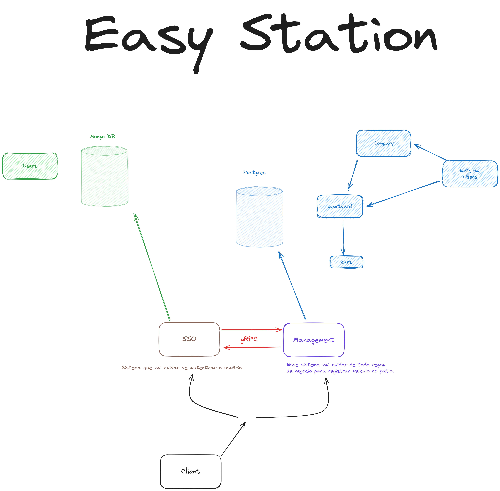

<p align="center">
  
</p>
<p align="center">Produto para empresas de estacionamento.</p>

## Descrição
O objetivo desse sistema é fazer toda a gestão de um estacionamento.

## Clonando Projeto

###### SSH

```bash
$ git clone git@github.com:julioceno/easy-station.git
```

###### HTTPS

```bash
$ git clone https://github.com/julioceno/easy-station.git
```

## Rodando Projeto

Após o projeto clonado entre no diretório do mesmo.

```bash
$ cd easy-station
```

Faça o download das dependências do projeto usando o `maven`.

Depois, rode o docker compose da aplicação:

```bash
$ docker compose up -d
```


**Lembre-se** de compilar as classes do grpc no projeto do sso e no do management também. 
</br>
**Lembre-se** de criar um usuario ADMIN para a partir dai criar usuarios comuns que poderão fazer parte das empresas.

## Arquitetura


Primeiro, vamos entender o que cada serviço faz e suas responsabilidades.

<p>
  <b>1. SSO</b> - Será o serviço que vai cuidar da autenticação e também do gerenciamento dos usuários.
</p>

<p>
  <b>2. Management</b> - Vai cuidar de toda parte de gerenciamento das empresas, seja ela desde os usuarios cuidarem de suas empresas, até os usuários cadastrarem carros nos pátios.
</p>

### Serviços Adjacentes


<p>
  1. Spring Boot
</p>
<p>
  2. Spring Security
</p>
<p>
  3. Grpc
</p>
<p>
  4. Junit
</p>
<p>
  5. Mockito
</p>